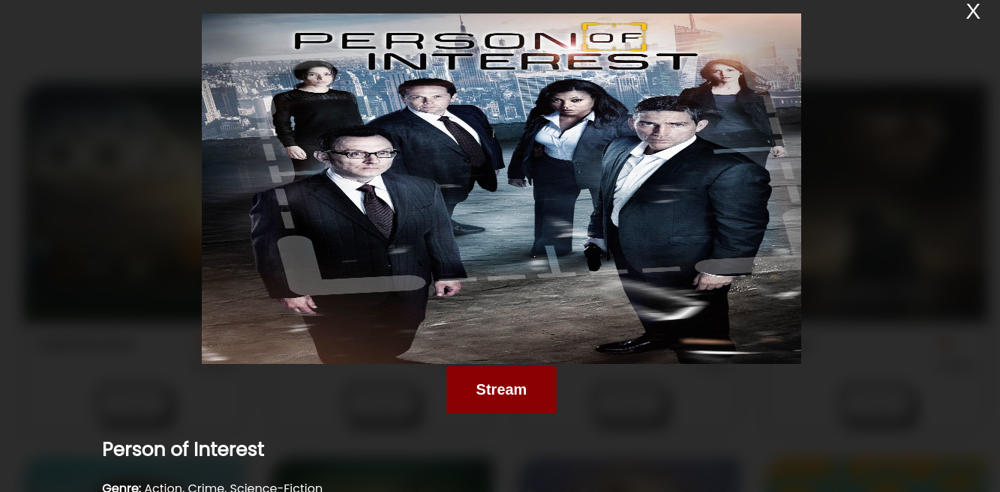

# Movie Capstone Project

> A website display list of movies from an external API. The webapp consist of tow user interfaces. It have home page with movies and popup window with detail of given movie. User can also add comments and view comments on popup window.





## Built With

- Html
- CSS
- Javascript
- Movie API
- Webpack
- JEST
- ES6

## Live Demo (if available)

[Live Demo Link]( https://libercosoft.github.io/movie-capstone-app/dist/)

## Getting Started

To get a local copy up and running follow these simple example steps.

```
git clone  https://github.com/LIBERCOSOFT/movie-capstone-app/
```

```
git checkout -b Development
```

```
git pull origin development
```

```
npm run start
```

### Prerequisites

- [Movie API](https://api.tvmaze.com/shows)
- `Webpack installation`
- `SSH key for github linked to git on local environment`
- `Html & CSS basics`

### Setup

- If it suits you, on your local computer, create a directory in your preferred location (e.g in the Desktop or Document directory)

### Install

### Usage

### Run tests

- Install project dependencies (libraries) using `npm install` command
- Run webpack build using npm run build command
- Run webpack dev server using npm run start command

### Deployment

## Authors

👤 **Author1**

- GitHub: [@LIBERCOSOFT](https://github.com/LIBERCOSOFT)
- Twitter: [@Gerfieldt](https://twitter.com/Gerfieldt)
- LinkedIn: [LinkedIn](https://linkedin.com/in/linkedinhandle)

👤 **Author2**

- GitHub: [@tonnymuchui](https://github.com/tonnymuchui)
- Twitter: [@tonnymuchui2](https://twitter.com/tonnymuchui2)
- LinkedIn: [LinkedIn](https://www.linkedin.com/in/tonny-muchui-murungi-9b549a174/)

## 🤝 Contributing

Contributions, issues, and feature requests are welcome!

Feel free to check the [issues page](../../issues/).

## Show your support

Give a ⭐️ if you like this project!

## Acknowledgments

- Hat tip to anyone whose code was used
- Inspiration
- microverseinc
- [The MovieDb](https://api.tvmaze.com/shows/)

## 📝 License

This project is [MIT](./MIT.md) licensed.
